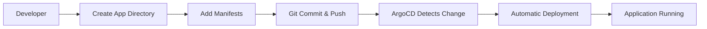

# Platform Engineering Lab - Setup & Architecture Guide

> **Complete setup instructions and architectural deep-dive for the GitOps-driven Kubernetes platform**

## 📋 Table of Contents

1. [Prerequisites](#prerequisites)
2. [Installation Guide](#installation-guide)
3. [Architecture Deep Dive](#architecture-deep-dive)
4. [Component Overview](#component-overview)
5. [GitOps Workflow](#gitops-workflow)
6. [Troubleshooting](#troubleshooting)
7. [Advanced Configuration](#advanced-configuration)

## Prerequisites

### Required Tools
- **Kubernetes Cluster** (Kind, EKS, GKE, AKS, or local)
- **kubectl** (v1.20+)
- **Git** client
- **Docker** (for local Kind cluster)

### Optional Tools
- **Kind** (for local development)
- **Helm** (for advanced configurations)
- **ArgoCD CLI** (for command-line management)

### Cluster Requirements
- **Minimum Resources:** 2 CPU, 4GB RAM
- **Kubernetes Version:** 1.20+
- **Storage Class:** Default storage class configured
- **Network:** LoadBalancer support (for ArgoCD UI access)

## Installation Guide

### Step 1: Prepare Kubernetes Cluster

#### Option A: Local Kind Cluster
```bash
# Install Kind (if not already installed)
curl -Lo ./kind https://kind.sigs.k8s.io/dl/v0.20.0/kind-linux-amd64
chmod +x ./kind
sudo mv ./kind /usr/local/bin/kind

# Create cluster
kind create cluster --name platform-idp-cluster

# Verify cluster
kubectl cluster-info
kubectl get nodes
```

#### Option B: Cloud Cluster (EKS/GKE/AKS)
```bash
# Ensure kubectl is configured for your cloud cluster
kubectl config current-context
kubectl get nodes
```

### Step 2: Install ArgoCD

```bash
# Create ArgoCD namespace
kubectl create namespace argocd

# Install ArgoCD
kubectl apply -n argocd -f https://raw.githubusercontent.com/argoproj/argo-cd/stable/manifests/install.yaml

# Wait for ArgoCD to be ready
kubectl wait --for=condition=available --timeout=300s deployment/argocd-server -n argocd

# Verify installation
kubectl get pods -n argocd
```

### Step 3: Deploy Platform Infrastructure

```bash
# Clone this repository
git clone https://github.com/SumithSingh18/platform-engineering-lab.git
cd platform-engineering-lab

# Create namespaces
kubectl apply -k platform/namespace

# Deploy platform root application
kubectl apply -f platform/cd/platform_root.yaml

# Verify deployment
kubectl get applications -n argocd
kubectl get namespaces
```

### Step 4: Access ArgoCD UI

```bash
# Get admin password
kubectl -n argocd get secret argocd-initial-admin-secret -o jsonpath="{.data.password}" | base64 -d

# Port forward ArgoCD server
kubectl port-forward svc/argocd-server -n argocd 8080:443

# Access UI at https://localhost:8080
# Username: admin
# Password: (from above command)
```

### Step 5: Verify Applications

```bash
# Check all applications
kubectl get applications --all-namespaces

# Check running pods
kubectl get pods -n apps

# Check services
kubectl get services -n apps
```

## Architecture Deep Dive

### GitOps Hierarchy

```
platform-root (Top-level ArgoCD Application)
├── Manages: platform/ directory
├── Creates: namespaces (platform, apps, test)
├── Deploys: platform infrastructure
└── Orchestrates child applications:
    ├── hello-app (Sample nginx application)
    └── task-manager (Custom application)
```

### Repository Structure

```
platform-engineering-lab/
├── README.md                          # Main documentation
├── Docs/
│   ├── README.md                       # This setup guide
│   └── images/                         # Architecture diagrams
├── platform/                          # Platform infrastructure
│   ├── kustomization.yaml              # Root kustomization
│   ├── namespace/                      # Namespace governance
│   │   ├── kustomization.yaml
│   │   ├── platform.yaml               # Platform team namespace
│   │   ├── apps.yaml                   # Application team namespace
│   │   └── test.yaml                   # Testing namespace
│   └── cd/                             # ArgoCD applications
│       ├── platform_root.yaml          # Root application
│       ├── hello-app.yaml              # Sample app
│       ├── task-manager.yaml           # Custom app
│       └── argo_template.yaml          # ArgoCD CRDs
└── apps/                              # Application manifests
    ├── README.md                       # Developer guide
    ├── hello-app/                      # Sample application
    │   ├── deployment.yaml
    │   ├── service.yaml
    │   └── kustomization.yaml
    └── task-manager/                   # Custom application
        ├── deployment.yaml
        ├── service.yaml
        └── kustomization.yaml
```

### Namespace Architecture

| Namespace | Purpose | Owner | Resources |
|-----------|---------|-------|-----------|
| **argocd** | ArgoCD controller and UI | Platform Team | ArgoCD components |
| **platform** | Platform infrastructure | Platform Team | Platform services, configs |
| **apps** | User applications | Product Teams | hello-app, task-manager |
| **test** | Testing and staging | DevOps Team | Test workloads |

### Network Architecture

```
┌─────────────────────────────────────────────────────────────┐
│                    Kubernetes Cluster                       │
│                                                              │
│  ┌─────────────┐  ┌─────────────┐  ┌─────────────┐         │
│  │   argocd    │  │  platform   │  │    apps     │         │
│  │ namespace   │  │ namespace   │  │ namespace   │         │
│  │             │  │             │  │             │         │
│  │ ArgoCD      │  │ Platform    │  │ hello-app   │         │
│  │ Server      │  │ Services    │  │ task-mgr    │         │
│  │ Controller  │  │             │  │             │         │
│  └─────────────┘  └─────────────┘  └─────────────┘         │
│                                                              │
│  ┌─────────────┐                                            │
│  │    test     │                                            │
│  │ namespace   │                                            │
│  │             │                                            │
│  │ Test Apps   │                                            │
│  └─────────────┘                                            │
└─────────────────────────────────────────────────────────────┘
```

## Component Overview

### ArgoCD Applications

#### 1. platform-root
- **Purpose:** Top-level orchestrator for entire platform
- **Source:** `platform/` directory
- **Destination:** `platform` namespace
- **Sync Policy:** Automated with pruning and self-healing
- **Manages:** Namespaces, platform infrastructure, child applications

#### 2. hello-app
- **Purpose:** Reference implementation demonstrating GitOps patterns
- **Source:** `apps/hello-app/` directory
- **Destination:** `apps` namespace
- **Image:** nginx:1.21
- **Replicas:** 4 with resource limits
- **Features:** Resource requests/limits, proper labeling

#### 3. task-manager
- **Purpose:** Custom application with CI/CD integration
- **Source:** `apps/task-manager/` directory
- **Destination:** `apps` namespace
- **Image:** sumithsingh001/task-manager (auto-updated)
- **Replicas:** 1
- **Features:** GitHub Actions integration, automatic image updates

### Kustomize Configuration

Each application uses Kustomize for configuration management:

```yaml
# Example: apps/hello-app/kustomization.yaml
apiVersion: kustomize.config.k8s.io/v1beta1
kind: Kustomization

resources:
- deployment.yaml
- service.yaml

commonLabels:
  app.kubernetes.io/name: hello-app
  app.kubernetes.io/managed-by: argocd
  team: backend
```

## GitOps Workflow

### Developer Workflow



#### Step-by-Step Process

1. **Create Application Structure**
   ```bash
   mkdir apps/my-new-app
   cd apps/my-new-app
   ```

2. **Add Required Manifests**
   ```bash
   # Create deployment.yaml
   # Create service.yaml  
   # Create kustomization.yaml
   ```

3. **Deploy via Git**
   ```bash
   git add apps/my-new-app/
   git commit -m "Add new application: my-new-app"
   git push origin main
   ```

4. **Monitor Deployment**
   - ArgoCD UI shows sync status
   - kubectl commands verify deployment
   - Application becomes available

### Platform Team Workflow

1. **Infrastructure Changes**
   ```bash
   # Modify platform/ directory
   # Update namespace policies
   # Add new ArgoCD applications
   git commit -m "Update platform configuration"
   git push origin main
   ```

2. **Governance Updates**
   ```bash
   # Update namespace configurations
   # Modify resource quotas
   # Update RBAC policies
   ```

### Rollback Process

#### Git-Based Rollback
```bash
# Find commit to revert
git log --oneline

# Revert specific commit
git revert <commit-hash>
git push origin main

# ArgoCD automatically syncs to previous state
```

#### ArgoCD UI Rollback
1. Navigate to application in ArgoCD UI
2. Click "History and Rollback" tab
3. Select desired previous revision
4. Click "Rollback" button
5. Confirm rollback operation

## Troubleshooting

### Common Issues

#### 1. ArgoCD Applications Not Syncing

**Symptoms:**
- Applications show "OutOfSync" status
- No pods created in target namespace

**Solutions:**
```bash
# Check application status
kubectl describe application <app-name> -n argocd

# Manual sync
kubectl patch application <app-name> -n argocd --type merge --patch '{"operation":{"sync":{}}}'

# Check ArgoCD logs
kubectl logs -n argocd deployment/argocd-application-controller
```

#### 2. Image Pull Errors

**Symptoms:**
- Pods stuck in "ImagePullBackOff"
- "Unauthorized" or "Not Found" errors

**Solutions:**
```bash
# Check pod events
kubectl describe pod <pod-name> -n apps

# Verify image exists
docker pull <image-name>

# Check image pull secrets (if using private registry)
kubectl get secrets -n apps
```

#### 3. Service Not Accessible

**Symptoms:**
- Service exists but not reachable
- Connection timeouts

**Solutions:**
```bash
# Check service endpoints
kubectl get endpoints -n apps

# Verify pod labels match service selector
kubectl get pods --show-labels -n apps

# Test service connectivity
kubectl run test-pod --image=busybox -it --rm -- wget -qO- <service-name>.<namespace>
```

#### 4. Namespace Issues

**Symptoms:**
- Resources not created in expected namespace
- Permission denied errors

**Solutions:**
```bash
# Verify namespace exists
kubectl get namespaces

# Check namespace labels
kubectl describe namespace <namespace-name>

# Recreate namespace if needed
kubectl delete namespace <namespace-name>
kubectl apply -k platform/namespace
```

### Debugging Commands

```bash
# Check all ArgoCD applications
kubectl get applications --all-namespaces

# View application details
kubectl describe application <app-name> -n argocd

# Check ArgoCD server logs
kubectl logs -n argocd deployment/argocd-server

# Check application controller logs
kubectl logs -n argocd deployment/argocd-application-controller

# View all resources in apps namespace
kubectl get all -n apps

# Check events for troubleshooting
kubectl get events -n apps --sort-by='.lastTimestamp'
```

## Advanced Configuration

### Multi-Environment Setup

To extend this platform for multiple environments (dev/staging/prod):

1. **Create Environment-Specific Branches**
   ```bash
   git checkout -b environments/dev
   git checkout -b environments/staging
   git checkout -b environments/prod
   ```

2. **Update ArgoCD Applications**
   ```yaml
   # platform/cd/hello-app-dev.yaml
   spec:
     source:
       targetRevision: environments/dev
     destination:
       namespace: apps-dev
   ```

3. **Environment-Specific Kustomizations**
   ```yaml
   # apps/hello-app/overlays/dev/kustomization.yaml
   apiVersion: kustomize.config.k8s.io/v1beta1
   kind: Kustomization
   
   resources:
   - ../../base
   
   patchesStrategicMerge:
   - deployment-patch.yaml
   ```

### RBAC Configuration

```yaml
# platform/rbac/developer-role.yaml
apiVersion: rbac.authorization.k8s.io/v1
kind: Role
metadata:
  namespace: apps
  name: developer
rules:
- apiGroups: [""]
  resources: ["pods", "services"]
  verbs: ["get", "list", "watch"]
- apiGroups: ["apps"]
  resources: ["deployments"]
  verbs: ["get", "list", "watch"]
```

### Resource Quotas

```yaml
# platform/quotas/apps-quota.yaml
apiVersion: v1
kind: ResourceQuota
metadata:
  name: apps-quota
  namespace: apps
spec:
  hard:
    requests.cpu: "4"
    requests.memory: 8Gi
    limits.cpu: "8"
    limits.memory: 16Gi
    pods: "10"
```

### Network Policies

```yaml
# platform/network-policies/apps-policy.yaml
apiVersion: networking.k8s.io/v1
kind: NetworkPolicy
metadata:
  name: apps-network-policy
  namespace: apps
spec:
  podSelector: {}
  policyTypes:
  - Ingress
  - Egress
  ingress:
  - from:
    - namespaceSelector:
        matchLabels:
          name: apps
```

## Next Steps

1. **Add Monitoring:** Integrate Prometheus and Grafana
2. **Secret Management:** Implement Sealed Secrets or External Secrets
3. **Security:** Add Pod Security Standards and OPA Gatekeeper
4. **Observability:** Add distributed tracing with Jaeger
5. **Backup:** Implement Velero for cluster backups
6. **CI/CD:** Integrate with GitHub Actions or Jenkins

## Resources

- [ArgoCD Documentation](https://argo-cd.readthedocs.io/)
- [Kustomize Documentation](https://kustomize.io/)
- [Kubernetes Documentation](https://kubernetes.io/docs/)
- [GitOps Principles](https://www.gitops.tech/)
- [Platform Engineering](https://platformengineering.org/)

---

This platform demonstrates production-ready patterns for GitOps-driven Kubernetes platforms. The same architecture scales from development environments to enterprise production deployments.