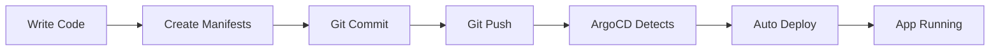
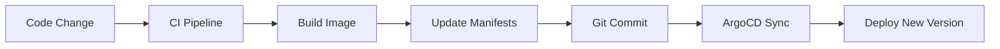

# Application Deployment Guide

> **Developer-focused guide for deploying applications using GitOps on the Platform Engineering Lab**

## 🎯 Overview

This guide shows developers how to deploy applications to the Kubernetes platform using GitOps principles. **No kubectl access required** - everything is done through Git commits.

## 🚀 Quick Start

### 1. Create Your Application Directory

```bash
mkdir apps/your-app-name
cd apps/your-app-name
```

### 2. Add Required Kubernetes Manifests

Create these three files in your app directory:

#### `deployment.yaml` - Your Application Deployment
```yaml
apiVersion: apps/v1
kind: Deployment
metadata:
  name: your-app-name
  namespace: apps
spec:
  replicas: 2
  selector:
    matchLabels:
      app: your-app-name
  template:
    metadata:
      labels:
        app: your-app-name
    spec:
      containers:
      - name: your-app-name
        image: your-registry/your-app:latest
        ports:
        - containerPort: 8080
        resources:
          requests:
            memory: "64Mi"
            cpu: "250m"
          limits:
            memory: "128Mi"
            cpu: "500m"
        env:
        - name: APP_ENV
          value: "production"
```

#### `service.yaml` - Service to Expose Your App
```yaml
apiVersion: v1
kind: Service
metadata:
  name: your-app-name
  namespace: apps
spec:
  selector:
    app: your-app-name
  ports:
  - protocol: TCP
    port: 80
    targetPort: 8080
  type: ClusterIP
```

#### `kustomization.yaml` - Kustomize Configuration
```yaml
apiVersion: kustomize.config.k8s.io/v1beta1
kind: Kustomization

resources:
- deployment.yaml
- service.yaml

commonLabels:
  app.kubernetes.io/name: your-app-name
  app.kubernetes.io/managed-by: argocd
  team: your-team-name
```

### 3. Deploy via Git

```bash
git add apps/your-app-name/
git commit -m "Add new service: your-app-name"
git push origin main
```

### 4. Monitor Deployment

- **ArgoCD UI:** Check sync status at https://localhost:8080
- **Verify pods:** `kubectl get pods -n apps` (if you have access)
- **Check logs:** View in ArgoCD UI or ask platform team

## 📋 Requirements & Standards

### Mandatory Requirements

✅ **Namespace:** All resources must target `namespace: apps`

✅ **Resource Limits:** Include CPU and memory requests/limits
```yaml
resources:
  requests:
    memory: "64Mi"
    cpu: "250m"
  limits:
    memory: "128Mi"
    cpu: "500m"
```

✅ **Labels:** Use meaningful labels for organization
```yaml
commonLabels:
  app.kubernetes.io/name: your-app-name
  app.kubernetes.io/managed-by: argocd
  team: your-team-name
```

✅ **Health Checks:** Include readiness and liveness probes
```yaml
livenessProbe:
  httpGet:
    path: /health
    port: 8080
  initialDelaySeconds: 30
  periodSeconds: 10
readinessProbe:
  httpGet:
    path: /ready
    port: 8080
  initialDelaySeconds: 5
  periodSeconds: 5
```

### Best Practices

🎯 **Security:**
- Run as non-root user
- Use read-only root filesystem when possible
- Implement proper RBAC

🎯 **Observability:**
- Include structured logging
- Expose metrics endpoint
- Add distributed tracing

🎯 **Configuration:**
- Use ConfigMaps for configuration
- Use Secrets for sensitive data
- Environment-specific values via Kustomize overlays

## 📱 Example Applications

### hello-app (Reference Implementation)

A complete example showing best practices:

```yaml
# apps/hello-app/deployment.yaml
apiVersion: apps/v1
kind: Deployment
metadata:
  name: hello-app
  namespace: apps
spec:
  replicas: 4
  selector:
    matchLabels:
      app: hello-app
  template:
    metadata:
      labels:
        app: hello-app
    spec:
      containers:
      - name: hello-app
        image: nginx:1.21
        ports:
        - containerPort: 80
        resources:
          requests:
            memory: "64Mi"
            cpu: "250m"
          limits:
            memory: "128Mi"
            cpu: "500m"
        env:
        - name: APP_NAME
          value: "Hello Platform Engineering Lab"
```

### task-manager (CI/CD Integration)

Shows integration with external CI/CD:

```yaml
# apps/task-manager/deployment.yaml
apiVersion: apps/v1
kind: Deployment
metadata:
  name: task-manager
  namespace: apps
spec:
  replicas: 1
  selector:
    matchLabels:
      app: task-manager
  template:
    metadata:
      labels:
        app: task-manager
    spec:
      containers:
      - name: task-manager
        image: sumithsingh001/task-manager:latest
        ports:
        - containerPort: 3000
```

## 🔄 Deployment Workflow

### Standard Workflow



### With CI/CD Integration



## 🔧 Advanced Configurations

### ConfigMaps and Secrets

```yaml
# config.yaml
apiVersion: v1
kind: ConfigMap
metadata:
  name: your-app-config
  namespace: apps
data:
  database_url: "postgres://db:5432/myapp"
  log_level: "info"

---
apiVersion: v1
kind: Secret
metadata:
  name: your-app-secrets
  namespace: apps
type: Opaque
data:
  api_key: <base64-encoded-value>
```

### Multi-Container Pods

```yaml
spec:
  containers:
  - name: app
    image: your-app:latest
    ports:
    - containerPort: 8080
  - name: sidecar
    image: logging-agent:latest
    volumeMounts:
    - name: logs
      mountPath: /var/log
  volumes:
  - name: logs
    emptyDir: {}
```

### Persistent Storage

```yaml
apiVersion: v1
kind: PersistentVolumeClaim
metadata:
  name: your-app-storage
  namespace: apps
spec:
  accessModes:
    - ReadWriteOnce
  resources:
    requests:
      storage: 1Gi
```

### Ingress Configuration

```yaml
apiVersion: networking.k8s.io/v1
kind: Ingress
metadata:
  name: your-app-ingress
  namespace: apps
  annotations:
    nginx.ingress.kubernetes.io/rewrite-target: /
spec:
  rules:
  - host: your-app.example.com
    http:
      paths:
      - path: /
        pathType: Prefix
        backend:
          service:
            name: your-app-name
            port:
              number: 80
```

## 🔍 Monitoring & Debugging

### Check Application Status

```bash
# View all applications in ArgoCD
kubectl get applications -n argocd

# Check specific application
kubectl describe application your-app-name -n argocd

# View application pods
kubectl get pods -n apps -l app=your-app-name

# Check pod logs
kubectl logs -n apps deployment/your-app-name
```

### Common Issues & Solutions

#### 1. Image Pull Errors
**Problem:** `ImagePullBackOff` or `ErrImagePull`

**Solutions:**
- Verify image name and tag are correct
- Check if image registry is accessible
- Add image pull secrets for private registries

#### 2. Pod Crashes
**Problem:** `CrashLoopBackOff`

**Solutions:**
- Check application logs: `kubectl logs -n apps pod/<pod-name>`
- Verify resource limits are sufficient
- Check health check endpoints

#### 3. Service Not Accessible
**Problem:** Cannot reach application

**Solutions:**
- Verify service selector matches pod labels
- Check service port configuration
- Ensure pods are ready and running

### ArgoCD UI Navigation

1. **Applications View:** See all deployed applications
2. **Application Details:** View resources, sync status, and health
3. **Live Manifest:** See actual Kubernetes resources
4. **Events:** View deployment events and errors
5. **Logs:** Access pod logs directly from UI

## 🎛️ Ownership & Responsibilities

### What You Own (Application Team)

✅ **Application Code & Images**
- Source code development
- Container image building
- Image registry management

✅ **Kubernetes Manifests**
- deployment.yaml configuration
- service.yaml setup
- kustomization.yaml management
- ConfigMaps and Secrets

✅ **Application Configuration**
- Environment variables
- Application-specific settings
- Feature flags and toggles

✅ **Service Dependencies**
- Database connections
- External API integrations
- Inter-service communication

### What Platform Team Owns

🏗️ **Infrastructure & Governance**
- Namespace creation and policies
- Resource quotas and limits
- Network policies and security

🏗️ **ArgoCD Configuration**
- GitOps setup and management
- Application registration
- Sync policies and automation

🏗️ **Cluster Operations**
- Kubernetes cluster management
- Node provisioning and scaling
- Backup and disaster recovery

🏗️ **Standards & Guardrails**
- Deployment standards enforcement
- Security policy implementation
- Compliance and auditing

## 🔄 Rollback & Recovery

### Git-Based Rollback (Recommended)

```bash
# Find the commit to revert
git log --oneline apps/your-app-name/

# Revert to previous version
git revert <commit-hash>
git push origin main

# ArgoCD automatically syncs to previous state
```

### ArgoCD UI Rollback

1. Navigate to your application in ArgoCD UI
2. Click **"History and Rollback"** tab
3. Find the desired previous revision
4. Click **"Rollback"** next to that revision
5. Confirm the rollback operation

### Emergency Procedures

If you need immediate help:

1. **Contact Platform Team:** Use designated Slack channel or email
2. **Check ArgoCD UI:** Look for error messages and sync status
3. **Review Recent Changes:** Check recent Git commits for issues
4. **Monitor Application:** Use provided monitoring dashboards

## 📚 Additional Resources

### Documentation
- [Kubernetes Deployment Guide](https://kubernetes.io/docs/concepts/workloads/controllers/deployment/)
- [Kustomize Tutorial](https://kustomize.io/tutorial/)
- [ArgoCD User Guide](https://argo-cd.readthedocs.io/en/stable/user-guide/)

### Tools & Utilities
- [kubectl Cheat Sheet](https://kubernetes.io/docs/reference/kubectl/cheatsheet/)
- [YAML Validator](https://www.yamllint.com/)
- [Kubernetes Resource Calculator](https://learnk8s.io/kubernetes-resource-calculator)

### Best Practices
- [12-Factor App Methodology](https://12factor.net/)
- [Kubernetes Security Best Practices](https://kubernetes.io/docs/concepts/security/)
- [Container Image Best Practices](https://docs.docker.com/develop/dev-best-practices/)

## 🆘 Getting Help

### Self-Service Resources
1. Check this documentation first
2. Review existing applications for patterns
3. Use ArgoCD UI for deployment status
4. Check platform monitoring dashboards

### Platform Team Support
- **Slack:** #platform-engineering
- **Email:** platform-team@company.com
- **Office Hours:** Tuesdays 2-4 PM
- **Emergency:** On-call rotation via PagerDuty

### Issue Categories

| Issue Type | Response Time | Contact Method |
|------------|---------------|----------------|
| **Critical Outage** | 15 minutes | PagerDuty |
| **Deployment Issues** | 2 hours | Slack |
| **Questions** | 1 business day | Email |
| **Feature Requests** | Weekly review | GitHub Issues |

---

**Remember:** Deploy through Git, never kubectl directly. The platform team is here to help you succeed! 🚀